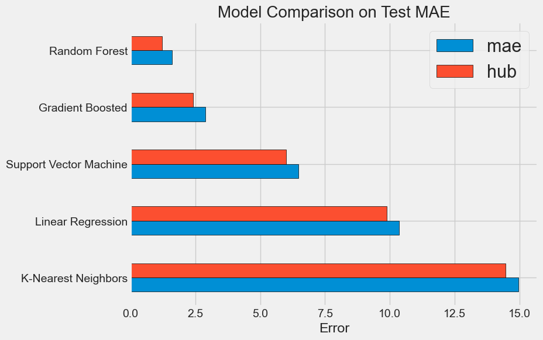
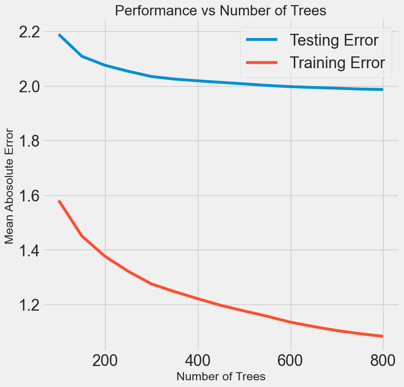
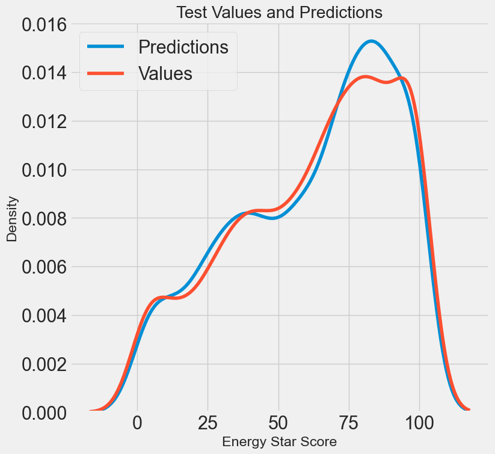
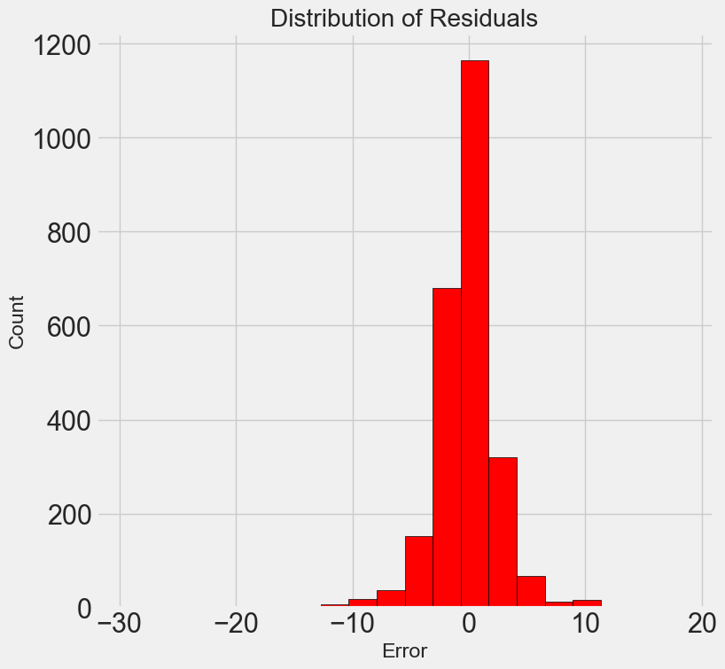

# machine-learning-project-walkthrough 

## 📌 Project Overview

This project involves using machine learning techniques to predict the Energy Star Scores for buildings in New York City. The Energy Star Score measures the energy efficiency of a building relative to similar buildings nationwide, and our task is to predict this score accurately based on various features.

# 📁 Project Structure
```
.
├── README.md
├── auto_ml
│   └── tpot_exported_pipeline.py
│       └── This Python script contains a machine learning pipeline automatically generated by TPOT, the Tree-based Pipeline Optimization Tool. TPOT is a genetic programming-based AutoML tool that automatically searches for the best ML pipeline using scikit-learn components.
├── data
│   └── Original and processed datasets used for model training/testing.
├── notebooks
│   ├── machine_learning_part1.ipynb (Data Cleaning, EDA, Feature Engineering)
│   ├── machine_learning_part2.ipynb (Model Comparison, Hyperparameter Tuning, Evaluation)
│   └── machine_learning_part3.ipynb (Model Interpretation, Conclusions, Reporting)
├── reports
│   └── PDF documentation and data definitions.
└── requirements.txt
    └── Python dependencies for reproducing the environment.
```
### 📊 **Dataset Metadata**

**Context:**

* Dataset includes energy and water usage data reported by New York City buildings under **Local Law 84 (LL84)** for benchmarking purposes.
* Maintained and published by the **New York City government** to encourage transparency and improvements in energy efficiency and sustainability in buildings.

**Content:**

* **Geography:** New York City, USA
* **Time Period:** Calendar Year 2016 (reported in 2017)
* **Unit of Analysis:** Individual buildings (private and city-owned)
* **Variables:** Energy Star Score, building size, building type, borough, energy usage intensity (EUI), electricity usage, water consumption, greenhouse gas emissions, and occupancy details.
* **Data Sources:** Self-reported by building owners/managers and verified by NYC authorities under LL84 benchmarking guidelines.

**Primary Source:**

* [NYC Open Data Portal - Energy and Water Data Disclosure for Local Law 84](https://data.cityofnewyork.us/Environment/Energy-and-Water-Data-Disclosure-for-Local-Law-84-/utpj-74fz)


## 🔧 Setup and Installation Instructions

### ⚙️ Compatibility

This project is specifically designed for **Python 3.10**. Ensure that you have Python 3.10 installed to avoid compatibility issues.

The project has been thoroughly tested on the following operating systems:
- **macOS** 
- **Linux Ubuntu** (20.04 and 22.04)

For other environments, results may vary, and additional setup might be required.

### 💻 Recommended Environment

As this is a compute-heavy task, it is recommended to use a cloud-based service with sufficient computational resources for optimal performance. Services such as **Google Colab**, **AWS**, or **Azure** can provide the necessary infrastructure to handle the intensive computations required for this project.

### Step 1: Download Project Files

Run the following command in your local terminal to download the project to your working directory:

```bash
git clone [repository name]
```
### Step 2: Setup Virtual Environment

Create and activate a virtual environment:

```bash
python3 -m venv .venv
source .venv/bin/activate   # Windows: .venv\Scripts\activate
```

### Step 3: Install Dependencies

Install necessary Python packages:

```bash
pip install --no-cache-dir -r requirements.txt
```

## 📈 Step-by-Step Guide

# Part 1: Data Preparation and Exploration

**Run jupyter notebook for the Part 1 `notebooks/machine_learning_part1.ipynb`**

## 1. Data Cleaning and Formatting

* Loaded and inspected the dataset, identified missing values, and irrelevant data.
* Removed features that contained a large proportion of missing values (>50%).
* Dealt with categorical variables and formatted them appropriately for analysis.

## 2. Exploratory Data Analysis (EDA)

* Explored the distribution and relationships between variables using visualizations.
* Identified and analyzed outliers and their potential impact on modeling.

## 3. Feature Engineering and Selection

* Created new features from existing data to improve model performance (e.g., logarithmic transformations of skewed data).
* Evaluated and reduced features by analyzing correlations and multicollinearity.
* Selected relevant features based on their potential influence on the Energy Star Score.

## 4. Establishing a Baseline

* Set a baseline prediction using a simple naive method (predicting the median Energy Star Score).
* Defined evaluation metrics (Mean Absolute Error - MAE) to measure model accuracy clearly and consistently.

# Part 2: Model Building and Comparison
**Run jupyter notebook for the Part 2 `notebooks/machine_learning_part2.ipynb`**

In the second notebook, you built and evaluated multiple machine learning models:
## 1. Preparing Data for Modeling

* Handled missing data through median imputation to ensure no data gaps.
* Applied feature scaling (Min-Max scaling) to normalize data for effective model training.

## 2. Model Evaluation

* Evaluated multiple machine learning models:

  * Linear Regression
  * Support Vector Machine (SVM)
  * Random Forest
  * Gradient Boosting
  * K-Nearest Neighbors (KNN)

* Each model's performance was compared using Mean Absolute Error (MAE), Mean Squared Error (MSE), and Huber Loss. Gradient Boosting and Random Forest emerged as the best-performing models using default hyperparameter settings. Their performance was similar, so we chose to go forward with Gradient Boosting by improving it with hyperparameter optimization. 

# Part 3: Model Optimization and Validation
**Run jupyter notebook for the Part 3 `notebooks/machine_learning_part3.ipynb`**


In the final notebook, you focused on optimizing and validating the chosen model from Part 2 (Gradient Boosting):

## 1. Hyperparameter Tuning

* Conducted hyperparameter optimization using Random Search with Cross-Validation, identifying the optimal settings for:

  * Loss function
  * Number of estimators (trees)
  * Tree depth
  * Minimum samples for splits and leaves
  * Feature selection strategy

## 2. Performance Optimization

* Evaluated the influence of the number of estimators (trees) on model performance to find the best balance between accuracy and model complexity.

## 3. Final Model Evaluation

* Tested the optimized model on an unseen test set to realistically estimate its predictive capability.
* Compared final model performance against a simpler baseline and default model configurations, demonstrating a substantial improvement.


### Step 4 ML Pipeline
```bash
 python3 auto_ml/tpot_exported_pipeline.py
```

This Python script is designed to accurately predict **Energy Star Scores** for buildings by utilizing a robust and optimized **Machine Learning Pipeline**. Its main objective is to demonstrate advanced methods for enhancing predictive accuracy, reliability, and consistency through careful model selection and tuning.

**Machine Learning Pipeline**

The pipeline employs a **stacked modeling technique**, combining multiple models to leverage their individual strengths.

- **Feature Selection Model**: Uses `LassoLarsCV` to simplify and identify the most predictive variables.
- **Regression Model**: Applies `Gradient Boosting Regressor`, known for handling complex, non-linear relationships effectively.

This structured pipeline ensures improved model accuracy and reduces the risk of overfitting.

**Model Training and Predictions**

- The optimized pipeline is trained on the prepared training dataset, enabling it to learn underlying patterns from historical building energy data.
- After training, it generates predictions on an unseen **test dataset** to simulate real-world application.

These predictions help assess how well the model generalizes to new data, which is critical for validating its effectiveness and reliability.

## 📊 EDA Overview

Here are some previews into the dataset that are explored by the script `notebooks/0_eda.ipynb`. 

The EDA process typically includes cleanup of data. This could be in the form of cleaning up data types (i.e. you have numerical data that has been stored in text format), removing duplicates, standardizing formats, dealing with missing data, and many others. To determine the best way of handling missing information, it is helpful to understand what fraction of the dataset is missing. While there are many ways to do this, in this project we sort columns based on the \% of empty cells they contain. We can then apply a cut at a percentile of our choosing, i.e. removing all columns that contain 50% or more missing cells.

<p align="center">
  
</p>

Deeper into the notebook, we break out properties based on their type, such as office spaces, schools, or housing. Then we can use density plots to observe whether or not the distribution Energy Star Scores varies based on property type. This same exercise is repeated using the year in which a building was constructed as its category. Both figures are below. The key takeaway from both of these figures is that there is, in fact, a trend between property types, year of construction, and Energy Star scores.

<p align="center">
  
   

</p>

Correlation studies are also a necessary part of the EDA process. They are important when it comes to removing collinear terms, and identifying those terms which are most strongly related to the target variable. In this project, you will find that the energy scores are strongly correlated to Site EUI (Energy Usage Intensity, or energy usage per square footage). To understand the nature of the relationship (i.e. is it linear, or is it more complex?) we can visualize the data with a scatter plot as follows. This shows that the relationship is not exactly linear, but that we should definitely include Site EUI as an input parameter in our ML model. 

<p align="center">
  
</p>

Some of the more advanced figures produced for EDA also include the pairs plots below. These show distributions of single parameters along the diagonal, scatter plots between two parameters in the upper half of the matrix, and 2-D density plots in the lower half. They help us visualize which relationships have stronger correlations, such as Site EUI and Weather-Normalized EUI, and which have weaker correlations, such as the log of the GHG Emissions (Greenhouse gas emissions). This gives us a more intuitive understanding of the relationships in our data which will inform ML modelling decisions.

<p align="center">
  
</p>

## 📊 Machine Learning Model Comparisons

In the second notebook, we explore different machine learning models and compare their performance using different loss functions. Below is a comparison figure.

<p align="center">
  
</p>

The Gradient Boosted model produces the following learning curve. While the training error appears much smaller than the testing error, the differnece between the two is only about 1.0 unit in Star Energy Score--very reasonable for a percentile value. In other words, even with the higher error in the test dataset, the model is still predicting energy scores that are, on average, within 2.0 from their truth value.

<p align="center">
  
</p>


## 📊 Project Results Summary

The goal of this machine learning project was to predict the **Energy Star Score** of New York City buildings using real-world energy usage data. After executing the end-to-end ML pipeline—data cleaning, feature engineering, model selection, hyperparameter tuning, and evaluation—we achieved the following results:

### ✅ Key Results

Our predictions closely resemble true values of Energy Star Scores in the test dataset, with the caveat that the model tends to overpredict values at the higher end (~80). Though the mean error is about 2 points, the distribution of residuals shows that some test predictions are as far away as $\pm$ 10 points from truth value. 

<p align="center">
  
  
</p>

#### Model Performance & Conclusions
* The final machine learning model is able to predict the Energy Star Score within an average error of **2 points**, demonstrating strong predictive capability on the test set. The most important variables for determining the Energy Star Score are the Energy Use Intensity, Nation Energy Use Intensiy, Electricity Use Intensity, and the Property Type.

#### Reproducibility and Code Quality
* All steps were documented using **Jupyter Notebooks**
* Code was modularized and thoroughly **commented** for clarity and future reusability
